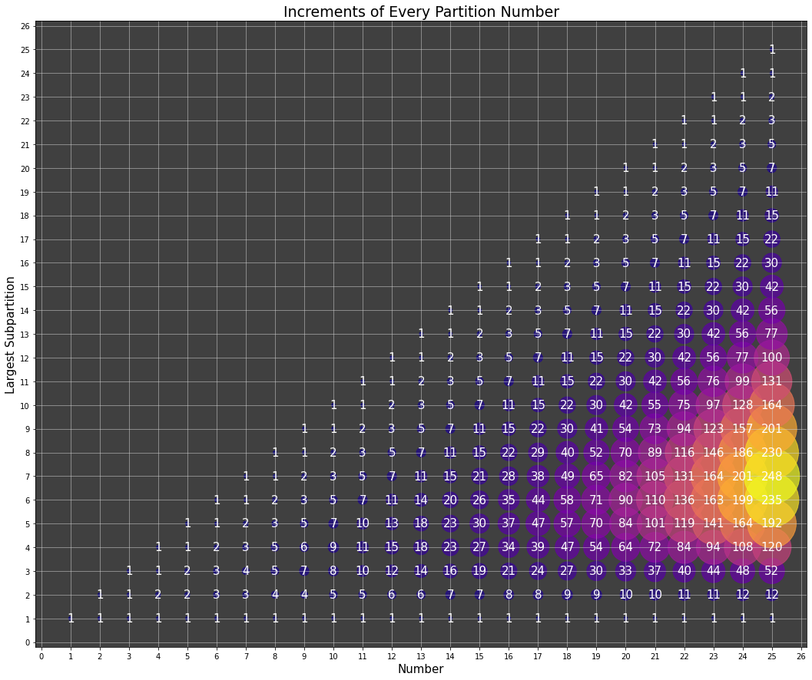
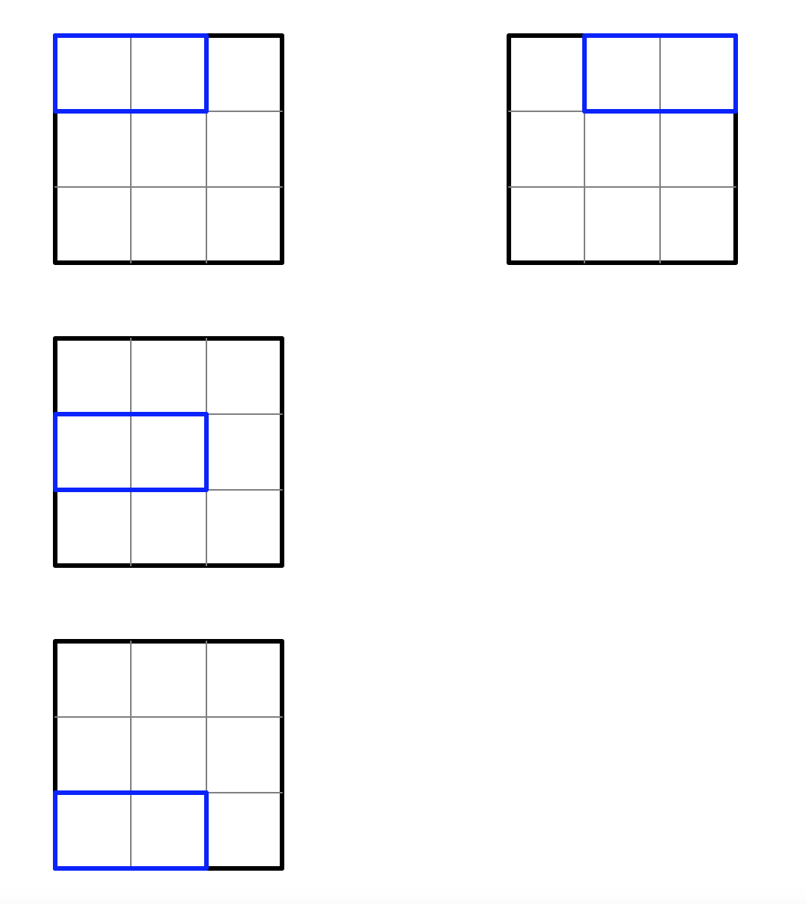

# Riddlers!

Hi! Here is my repository for [538's weekly Riddler puzzles](https://fivethirtyeight.com/tag/the-riddler/) and more! The files in this repo are my code for either 538's bite-sized *Riddler Express* and/or their "slow puzzle movement" *Riddler Classic* in addition to any riddles I come across (usually while running or chatting with my run friends). I explain my logic for each riddle below. Enjoy!

* **[11/19/21 Riddler Express](https://fivethirtyeight.com/features/are-you-the-fittest-gym-rat/)**
    * pdf's and expected value!

        So at first glance, it seems like the answer is 50%. If you go to the gym 50% the time it is open, half of the people will go more often than you and half of the people will go less often than you - but as we have learned from Riddler, the answer never comes that easy.

        On second thought, we know that if a person comes to the gym, say, 1% of the time it is open, you are less likely to meet that person than if a person comes to the gym 99% of the time. We know that the probability distribution is uniform from 0% to 100%, or pdf(x) = 1; thus, we know that the expected value of the probability of someone attending the gym is the integral $$\int_a^b pdf(x) \times x \,dx$$, or $$\int_0^1 x \ dx$$

        

        As we can see with this integral, the integral on the interval [0, 0.5] is 0.25x as much as the integral from [0.5, 1]. Thus we know that the probability that the friend you meet goes to the gym more often than you is 3/4, or **75%**.

        (I also made a simulation and found the answer to converge to 0.75!)

* **[11/12/21 Riddler Express](https://fivethirtyeight.com/features/can-you-stick-it-to-the-genie/)**
    * So no, unfortunately I cannot stick it to the genie. I can, however, shoot dice.

        When we look at the three dice of d4, d6, and d8, we know that there are 4x6x8, or 192 unique combinations (or permutations? I can never get them straight) to be made. Of those, we want to find all the strictly increasing combinations. For an example, if on the d4 we roll a 3, we will only count rolls in which on the d6 we roll a 4, 5, or 6. On the d8, if the d6 roll were a 4, we will only count rolls of 5-8. If the d6 roll were a 5, 6-8. And a 6, then 7 and 8. Thus, I just made three for-loops to find all the possible strictly increasing sequences. I found there to be 48 strictly increasing sequences for a probability of 48/192, or **25%**.

        Extra credit: For the extra credit, the same logic applies. This time, there are 4x6x8x10x12x20 unique combinations, or 460800 unique combinations. With 6 for-loops, I found that there are 5434 unique strictly increasing sequences for a probability of around **1.-17925%**.

* **[11/5/21 Riddler Classic](https://fivethirtyeight.com/features/how-many-friends-are-on-the-riddler-social-network/)**
    * Hi! What a nifty Riddler this was!
    
        Initially, I thought about using brute force method along the sort of `for num in range(1, sqrt(number))` to find every factor (and hence the sum of all the factors) of a number. Yet, I couldn't help but feel that this method was very inefficient. Upon further thinking, I was wondering [how to find the sum of all factors from prime factorization](https://www.math.upenn.edu/~deturck/m170/wk3/lecture/sumdiv.html), which would save a lot of unnecessary work.

        With that in mind, I decided to make a dictionary which stores the prime factorization of every number, and I would work with my dictionary to find the prime factorization of every new number. For an example, we know that the prime factorization of 9 is 3^2, and we also know that 18 = 9x2, so we know that the prime factorization of 18 is just the prime factorization of 9 with an additional 2, or 3^2 x 2. From there, I could find the sum of all factors and see if that number fulfilled the property.

        Using my algorithm, I found two additional numbers, **378 and 49600**. We know that the factors of 378 are [1, 2, 3, 6, 7, 9, 14, 18, 21, 27, 42, 54, 63, 126, 189,  378], with a sum of all the factors equalling 960; 378 inches = 960.12 centimeters. We also know that the factors of 49600 are [1, 2, 4, 5, 8, 10, 16, 20, 25, 31, 32, 40, 50, 62, 64, 80, 100, 124, 155, 160, 200, 248, 310, 320, 400, 496, 620, 775, 800, 992, 1240, 1550, 1600, 1984, 2480, 3100, 4960, 6200, 9920, 12400, 24800, 49600], with a sum of 125984; 49600 inches = 125984 centimeters.

        That Riddler was a doozy! I am very excited to see what other numbers (if any) that Riddler Nation is able to find and how they went about it.

* **[10/29/21 Riddler Classic](https://fivethirtyeight.com/features/can-you-survive-squid-game-riddler/)**
    * Ah, the Squid Game!
    So this problem, just FYI, is very similar to the 8/13/21 Riddler Express I did a few weeks ago.

        We want to find the average number of survivors for this challenge, or the weighted average of the number of survivors for every scenario: 1xP(1 survivor) + 2xP(2 survivors) + 3xP(3 survivors) + ... + 16xP(16 survivors). To find the probabilities, we can use binomial distribution. For an example, P(3 survivors) = P(13 deaths) = 18C3 x (0.5)^18 (since the probability of life and death are both 0.5). I found this answer to be approximately **7 survivors** (7.0000152587890625, to be exact), which is much better than the 3 who survived on the show. They got really unlucky, and they had a glass maker on their side!

        For an approximation, we know that each of the 18 steps has a 50% chance of breaking. Thus, it is expected that every contestant will step on 2 glass tiles before falling to their death. In order to traverse the 18 steps, we can estimate 18/2 = 9 deaths, or 7 survivors - an estimation very, very close to the actual answer.

        On a sidenote, the reason why I have two files for this Riddler is one for the general code and a second, more optimized one for speed since we know that the probabilities of binomial distribution are symmetric. I am doing so because my friend and I placed a bet ([*HIMYM*](https://en.wikipedia.org/wiki/Slap_Bet), anyone?) on who could code a faster run time for this solution... I will keep you all updated!
        
        (Update: I had the faster run time as my friend used dynamic programming to come up with his solution, but that begs the question... how can I use DP to come up with this solution?)

* **[10/15/21 Riddler Express](https://fivethirtyeight.com/features/can-you-hit-these-riddles-out-of-the-park/)**
    * Since the first team to 4 wins wins, and Team A wins p% of the time, I created a recursive function that ends when one team hits 4 wins and weigh a Team A win at p% and a Team B win at (1-p)%. The answer is **5.8125**.
    This question can also be solved via binomial distribution: the probability that the series ends after 4 games is (4C0) * (p)^4 * (1-p)^0 + (4C0) * (p)^0 * (1-p)^4 (so 4-0 or 0-4), or 0.125 if p = 0.5. We can do this for 5, 6, and 7 games and find the weighted average, which will also yield the answer 5.8125. Kudos to anyone with the patience to do this by hand!

* **[10/08/21 Riddler Express](https://fivethirtyeight.com/features/can-you-evade-your-evil-twin/)**
    * We know that the jackpot is worth $10m, each ticket costs $1, and 10 other tickets will be winning tickets (from the time travelers). Thus, our payout is the function f(x) = ($10m/(10+x))-x. We can easily take the first derivative, or alternatively I maximized the function with SciPy to find that the optimal number of tickets is **9990** with a payout of $9,980,010. With that kind of money, the first thing I would buy is a new house for my mom... and then I would buy a slightly bigger house for myself.

* **[09/24/21 Riddler Classic](https://fivethirtyeight.com/features/can-you-climb-your-way-to-victory/)**
    * For this Riddler, I ran 10 million Monte Carlo simulations to find the answer of **48**. Knowing that there were 3 events for the 8 contestants, I shuffled the 3 lists and had each index represent a contestant:
        ```python
        list1 = shuffle(list(range(1,9)))
        list2 = shuffle(list(range(1,9)))
        list3 = shuffle(list(range(1,9)))
        for i in range(8):
            score = list1[i]*list2[i]*list3[i]
        ```
        For an example, my three lists of [1,2,3,4,5,6,7,8], [1,2,3,4,5,6,7,8], [1,2,3,4,5,6,7,8] could be shuffled into  [6,7,1,3,4,2,8,5], [5,2,6,3,4,7,1,8], [8,6,4,5,1,3,2,7]. Thus, player 1 (at index 0) would have a final score of 6x5x8 = 240 and player 2 (at index 1) would have a final score of 7x2x6 = 84. I would do this for every player and return the minimum and maximum scores. I found the maximum of the minimum (winning) scores to be 48 and the minimum of the maximum (losing) scores to be 60.
        I made a heatmap and bar charts to show the distribution of scores from my simulations.
        
        Heatmap:
        
        Distribution of Winning Scores:
        
        Distribution of Losing Scores:
        

* **[08/27/21 Riddler Classic](https://fivethirtyeight.com/features/can-you-draft-a-riddler-fantasy-football-dream-team/)**
    * Happy start of football! Go KC Chiefs! Despite the heartbreaking flashbacks to Super Bowl 43, I went ahead to code this Riddler (I was in 4th grade during Super Bowl 43, and I am still so sad that Larry Fitzgerald didn't win a ring). Rather than set Hames Jarrison's speed to 15mph, I normalized his speed to 1 and calculated how quickly one would have to run (say, Farry Litzgerald) relative to Hames Jarrison's speed to catch him before the end zone. Thus, with every increment, Hames Jarrison would move forward by 0.001 yards, and Farry Litzgerald would move toward Hames Jarrison by 0.001*multiplier yards. From there, I used binary search to find out exactly how fast Farry Litzgerald would run to meet Hames Jarrison. I found that if Litzgerald ran 1.2807822227478027 times as fast as Jarrison, he would not reach Jarrison before the endzone, and if Litzgerald ran 1.2807830047607422 times as fast, he would. This means that Litzgerald would have to run about 15x1.28078 times as fast as Jarrison, or approximately **19.211** miles per hour. To put that in perspective, a 19.211mph 100m dash would take around 11.6 seconds, and this is on turf too!

        Here is a visualization of the path Farry Litzgerald would take to catch Hames Jarrison:
        

* **[08/13/21 Riddler Express](https://fivethirtyeight.com/features/are-you-clever-enough/)**
    * To solve this Riddler, we need to use binomial distribution. 
    Lets say among the 9 other people, 1 is in the top 90% (so 8 are in the bottom 90%). The probability that exactly other 1 person is in the top 90% is (9C1) * (0.9)^8 * (0.1)^1, or around 38.7%. With you and the 1 other person in the top 90% (a little Bayes' here), the probability you are the top Riddler is 38.7% * 1/2 = 19.4%. To reiterate, with 1 other person in the top 90%, you have a 19.4% change of being the top Riddler. I calculated these probabilities given that 0, 1, 2, 3, ..., 9 others in the group are in the top 90%, summed the probabilities, and found an answer of approximately **65.13%**. The key line of my code is seen here:
        ```python
        percent_cleverest = (math.comb(9,i)*((0.9)**(9-i)*(0.1**(i)))*(1/(1+i)))
        ```

* **[07/30/21 Riddler Express](https://fivethirtyeight.com/features/will-riddler-nation-win-gold-in-archery/)**
    * At first glance, we can see that the expected score of Riddler Nation is 24. Isn't that convenient! At second glance, however, I realized that the distribution of scores may not be symmetric: for an example, a 99% chance of scoring 0 and a 1% chance of scoring a 2400 also yields an expected score of 24, but no way the odds of each team winning are 50-50.
    I found the 27 permutations for the series of 3 shots and counted the total number of permutations below, at, and above 24 points (10, 6, and 11). Because we know that the ties go into another 3 shots, the answer is 11/21, or the number of permutations that Riddler Nation scores above 24 divided by the number of all non-tying outcomes.

* **[07/30/21 Riddler Express](https://fivethirtyeight.com/features/can-you-hop-across-the-chessboard/)**
    * This Riddler may have the 'Express' suffix, but I promise you that coding this algorithm was not express at all!
    I created a matrix of the chess pieces and all the possible moves for each piece, as seen below:
        ```python
        matrix = [
        ['K', 'BL', 'b', 'BL', 'K', 'r', 'b', 'r'],
        ['n', 'r', 'n', 'n', 'p', 'n', 'K', 'b'],
        ['r', 'BL', 'n', 'BL', 'p', 'r', 'p', 'r'],
        ['BL', 'BL', 'p', 'r', 'BL', 'n', 'BL', 'BL'],
        ['n', 'n', 'n', 'b', 'BL', 'b', 'r', 'b'],
        ['q', 'r', 'n', 'p', 'BL', 'n', 'r', 'q'],
        ['BL', 'BL', 'r', 'p', 'b', 'p', 'b', 'q'],
        ['K', 'b', 'q', 'n', 'p', 'r', 'n', 'n']]
        #initial position is matrix[6][4], bishop
        b_moves = [[1,1], [1,-1], [-1,-1], [-1,1]]
        r_moves = [[1,0], [-1,0], [0,1], [0,-1]]
        n_moves = [[-1,2], [-2,1], [-2,-1], [-1,-2], [1,-2], [-2,1], [2,1], [1,2]]
        p_moves = [[-1,-1], [-1,1]]
        q_moves = b_moves+r_moves
        ```
        I then wrote a BFS helper function which took the initial Bishop and moved it in every way possible. From there, I took each piece from the new square that the bishop could have moved into and moved that new piece in every way possible. I kept doing this until a piece either moved into the King's square or a black piece's square. I found three paths to reach a King:
        * 1. [(6, 4, 'Bishop'), (5, 3, 'Pawn'), (4, 2, 'Knight'), (5, 0, 'Queen'), (4, 1, 'Knight'), (2, 2, 'Knight'), (1, 4, 'Pawn'), (0, 5, 'Rook'), (0, 4, 'King')]
        * 2. [(6, 4, 'Bishop'), (5, 3, 'Pawn'), (4, 2, 'Knight'), (5, 0, 'Queen'), (4, 1, 'Knight'), (2, 2, 'Knight'), (1, 0, 'Knight'), (0, 2, 'Bishop'), (1, 3, 'Knight'), (2, 5, 'Rook'), (3, 5, 'Knight'), (1, 6, 'King')]
        * 3. [(6, 4, 'Bishop'), (5, 3, 'Pawn'), (4, 2, 'Knight'), (5, 0, 'Queen'), (4, 1, 'Knight'), (2, 2, 'Knight'), (1, 0, 'Knight'), (0, 2, 'Bishop'), (1, 1, 'Rook'), (1, 2, 'Knight'), (0, 0, 'King')]


* **[07/16/21 Riddler Express and Classic](https://fivethirtyeight.com/features/can-you-win-the-penalty-shootout/)**
    * **Express:**
    For the sake of simplicity, let's assume that the length of the stick is 1. When Fatch fetches the stick (say that 10 times fast), we know that the top portion will be painted black and the bottom portion white. We can denote the black area with length x and the white area with length 1-x (note that black + white = 1).
    We want to know the probability Fetch and Fitch fetch the stick by biting in the same colored area, which will be black-black, (x)^2, or white-white, (1-x)^2, so x^2 + (1-x)^2. Because Fatch bites the stick at a random point, we know that the length of x (and thus the length of 1-x) will be distributed uniformly from 0 to 1. We can integrate the equation above from the interval (0,1) (I lost my handy TI-84 so I put it into SciPy) to find our answer of **0.667**.
    
    	
    
    	I found this problem three times as difficult as usual due to the fact that I had to (1) do the math, (2) keep up with the names of Fatch, Fetch, and Fitch         (which somehow are *way* more confusing than Kim, Khloe, and Kourtney), and (3) decide whether I would integrate by hand, WolframAlpha, SciPy, or spend the         effort trying to find my TI-84.
    * **Classic**
    The math for this Riddler looked scary, and it was getting late, so I decided to run simulations to get the answer. As you can see in my code, the hardest part was coding the stop conditions... with my initial 'if statements', I kept missing edge cases. After calling my good friend for help, we figured out that a more straightfoward process would be not to find every case in which the shootout would end but to use a general case, which ended up being if *goal difference > goals remaining*. We can see this in my code:
        ```python
        if (team_a-team_b > 0 and team_a-team_b > b_kicks_left) or (team_a-team_b < 0 and team_b-team_a > a_kicks_left):
            return (a_count+b_count)
        ```
        Because there is the case of overtime (tied after 5 rounds, or 10 shots), I had to add a second condition to account for this:
        ```python
        if (a_count + b_count) > 10:
            if team_a != team_b:
                return (a_count+b_count)
        ```
        I ran 10 million simulations and found the average number of shots to be around **10.47**. Go Tottenham Hotspurs!

* **[07/09/21 Riddler Express](https://fivethirtyeight.com/features/can-you-solve-this-astronomical-enigma/)**
    * **Express:**
    For this brute force solution, I used Math's GCD function to find pairs of numbers between 1 and 20 that were relatively prime. I then threw the pair of numbers into my years function, which would find keep finding multiples of each number in the pair until the difference between two multiples was 1, which would result in an interference.
        ```python
        def years(num1, num2):
            sum1 = 0
            sum2 = 0
            while abs(sum1-sum2) != 1:
                if sum1 <= sum2:
                    sum1 += num1
                else:
                    sum2 += num2
            return [num1, num2, max(sum1, sum2)]
        ```
        I found the answer to be **153 years**, when one brood of cicadas emerges every 19 years and the other emerges every 17 years. I made a table (below) to show the latest possible interference for every pair cicada broods:
        


* **[Riddles.py](Riddles)**

    * [Euler #78](https://projecteuler.net/problem=78)
        * I will admit that for this riddle I got help (I know, I know), and I will get back to that later.

            When I saw this question, the first thing that screamed to me was recursion and dynamic programming. To help explain, let's look at the partitions of 2, or p(2)=2:
            * 2
            * 1+1

            Now let's look at the partitions of 5 (note that my partitions are listed in descending order from up to down, left to right):
            * 5
            * 4+1
            * 3+2
            * 3+1+1
            * 2+2+1
            * 2+1+1+1
            * 1+1+1+1+1

            Let's take a closer look at the partition of 5 where 3 is the largest "subpargition," so 3+2 and 3+1+1. When 3 is the largest "subpartition", we know that the remaining 2 coins can be split in 2 different ways, 2 and 1+1... which is exactly p(2)! Thus, we know that if the largest "subpartition" is 3, there are p(5-3) ways to partition. But hold up, what happens if the largest "subpartition" is 2? We cannot partition the coins in the manner of 2+3 because that would be double counting 3+2, and 2 < 3, but we can partition 2+2+1 and 2+1+1+1.
            
            So here is my rule: *if the largest "subpartition" is greater than or equal to the remaining elements (i.e. 3 > 2), we know that there are p(remainder) possibilities to partition. However, if the largest "subpartition" is less than the remaining elements (i.e. 2 < 3), we know there are p(remainder) possibilities minus all the possibilities in which the largest "subparition" is greater than this "subpartition"* ... that's a mouthful.
            
            I went on to code this problem using a dictionary where I would store every partition and "subpartition" to solve for subsequent partitions, but that process jacked up the time complexity and would not run. Thus, I looked up the answer and found that the answer is less than 60,000, which is why I opted for a 60,000x60,000 matrix instead of a dictionary (faster lookup time). However, after calculating around the first 35,000 partition numbers, my computer gave me the dreaded Kill 9 error :( (and it took about 2 hours to run... not optimal).

            I took to [Wikipedia](https://en.wikipedia.org/wiki/Partition_(number_theory)) and found that Euler's method can be used as a generating function to find partition numbers, which I then took to code. I found the answer to be **55374** with the number of partitions equalling 36325300925435785930832331577396761646715836173633893227071086460709268608053489541731404543537668438991170680745272159154493740615385823202158167635276250554555342115855424598920159035413044811245082197335097953570911884252410730174907784762924663654000000, and to my satisfaction it ran in about 10 seconds (compared to over 2 hours).

            And just for fun, I made two visualizations: one is a scatterplot of the breakdown of "subpartitions" for every partition number from 1-25, and the second is the partition number for numbers 1-25.
            Here are the two visualizations below:

            
            


    * [Euler #91](https://projecteuler.net/problem=91)
        * Whoo! This question is of 25% difficulty, which is the highest difficulty problem I have solved thus for in Project Euler! *Self five!*

            My first step was finding the points that can make up all possible triangles. While there are many solutions out there, I decided to do some combinatorics! I generated all possible (x,y) integer pairs between 0 and 50 (inclusive) with the exception of (0,0), which turned out to be 2,600 points in total (51x51-1). Then, I found every two-point pair combination, which turned out to be 3378700 combinations, or 3378700 distinct triangles!

            For step 2, I took each triangle and tried to find if the triangle contained a right angle. I went back to middle school geometry for this: we know that if two lines are parallel, their slopes are negative inverses. I thus wrote a function to check all three verticies of the triangle to see if the two sides met at 90 degrees. To deal with the problem that a slope would be infinity (vertical line), I used a try-except statement that would have any vertical lines have a slope of float("Inf"). (I would also like to mention that due to rounding error, as long as the slopes of the lines were within 0.0001 of their negative inverse, the triangle is considered a right triangle.) I iterated through all 3378700 triangles and found that **14234** triangles are right triangles.

    * [Euler #19](https://projecteuler.net/problem=19)
        * Ahhh, counting Sundays! (It is just me, or when every Sunday comes around, a bit of unease settles in knowing that tomorrow is Monday?)

            So this was a relatively straightforward riddle. Thankfully, since we know that January 1, 1900 is a Monday, we know that the 7th day of the century, January 7, 1900, is a Sunday. The 14th day of the century, January 14, 1900, is also a Sunday. Thus, we know that if the nth day of the century is a Sunday, n has to be divisible by 7. From there on, I just "advanced the calendar" one month at a time. For an example, to advance from January to February, I add 31 days to the century. From February to March, I add 28 (or 29) days. And so on. Every 12th time I advance the calendar, I add one to the year. If the year is between 1901 and 2000 (inclusive), right after I advance the calendar, if the day of the century is divisible by 7, we know that the 1st of that month is a Sunday. I keep running this process until 2001, and I find that there are **171** Sundays in the century!

   * [Euler #85](https://projecteuler.net/problem=85)
        * In honor of Patrick Mahomes' wonderful performance this last Sunday night, I decided to tackle a Project Euler question of 15% difficulty (brownie points if you get the reference!).

            I see two parts to this question. The first is to determine how many rectangles a mxn rectangle can encompass, and the second is to find the dimensions that can get that number as close to 2 million as possible.

            

            For part 1, lets consider the 3x3 rectangle above. We can see that if we want to fit a 1x2 (or is it 2x1, I can never remember) rectangle in the 3x3, it can "slide" left and right two positions. The 1x2 rectangle can also "slide" up and down 3 positions. Thus, we know that there are 6 ways (3x2) the 3x3 rectangle can contain a 1x2 rectangle. Thus for the first part, I wrote a function that found out every possible dimension a rectangle can fit in the bigger rectangle, found how many positions the rectangle could "slide" left-right and up-down, and summed the total.

            For part 2 (finding the rectangle dimension closest to containing 2,000,000 rectangles), I used a brute force method. I started with a 1x1 rectangle and kept adding length (i.e. 1x2, 1x3, 1x4, ..., 1xn) until the rectangle would break 2,000,000 possible nested rectangles. I then took a 2x1 rectangle and kept adding to the rectangle (i.e. 2x2, 2x3, 2x4, ..., 2xn) until that rectangle broke 2,000,000 nested rectangles. Just an FYI, for the 1xn rectangle, the dimension ended up being 1x1999, and for a 2xn rectangle, the dimension ended up being 2x1154. Then, I took a 3xn rectangle, 4xn rectangle, and so on. I found out that a 36x77 rectangle could contain 1,999,998 rectangles, leading to an answer of **2772**. Now THIS is an MVP worthy puzzle!

   * [Euler #112](https://projecteuler.net/problem=112)
        * In order to determine if a number is bouncy, I used the mod function to iterate through a number. For an example, with the number 134468, I iterated through the number backwards, in the order 8-6-4-4-2-1 (8 = 134468%10, 6 = 13446%10, and so on). If the numbers kept increasing or decreasing to completion, the number is not bouncy. Otherwise, it is.
        With that function, I ran a while loop until the proportion of bouncy numbers reached exactly 0.99 (I actually started at 538, where the proportion of bouncy numbers first reaches 50% as seen in the problem to avoid a divide by zero error when calculating the proportion). I found the answer to be **1587000**.

    * [Euler #12](https://projecteuler.net/problem=12)
        * I knew that you can find the [number of divisors of a number via prime factorization](https://www2.math.upenn.edu/~deturck/m170/wk2/numdivisors.html). Thus, I wrote a prime factorization helper function and then used that function to find the number of divisors. I finished by generating the next triangle number until I found one with more than 500 divisors, which turned out to be **76576500**.

    * [Euler #22](https://projecteuler.net/problem=22)
        * I don't know about you, but in honor of Taylor Swift dropping Red this week, I was feeling question 22. In this problem, I just iterated through every name and every letter in every name, using the ord() function to find the value for each letter (a dictionary works too). (Please note that I subtracted 60 from every name due to the quotation marks.) Then, I multiplied the value of the name by its index+1 to find an answer of **871198282**.

    * [Euler #72](https://projecteuler.net/problem=72)
        * I initially tried to use brute force to solve this problem by using prime factorization (finding if the GCF of a pair of numbers is 1), which I quickly realized jacked up the time complexity. Even using the Math GCD function, it would take too long to run the problem up to 1,000,000. At a loss (and I will admit that this came with a bit of shame), I went to Google for inspiration.

            Turns out, this problem is very close to [Project Euler #69](https://projecteuler.net/problem=69). That problem's illustration gave me an idea of how to solve this problem:
            
            
        
            I can just sum up Euler's totient function from 2 to 1000000.

            With [some further Googleing](https://www.doc.ic.ac.uk/~mrh/330tutor/ch05s02.html) and [a YouTube video](https://www.youtube.com/watch?v=qa_hksAzpSg), I went back to work. Most importantly, I learned that phi(A*B) = phi(A)*phi(B) if A and B are coprime.
            
            I continued by generating primes from 1 to 1000000, using the [Sieve of Eratosthenes](https://en.wikipedia.org/wiki/Sieve_of_Eratosthenes) (because once again, iteration took too long). From there, I created a list of length 1,000,000. If a number is prime (i.e in my list of primes), we know that phi(number) = number - 1. If the number has two coprime factors, we know that phi(A*B) = phi(A)*phi(B). And if all else fails, we can just use Euler's totient function. With these lines of code, I found the answer to be **303963552391**. It takes about 80 seconds to run this algorithm. While I know that this algorithm is not optimal, I am just relieved that I found a way to an answer that doesn't require me to leave my computer running overnight!


    * [Euler #8](https://projecteuler.net/problem=8)
        * In order to find the greatest product of 13 adjacent numbers in this \~big scary number\~, I realized that I need to create a sliding window of size 13 and move that window through the entire number. The first step was to turn the \~big scary number\~ into a list. Then, I created a sliding window of size 13 with the code `window = list[i-13:i]`. For every window, I would calculate the product. The maximum product is **23514624000**.

    * [Euler #3](https://projecteuler.net/problem=3)
        * For this problem, I kept dividing 600851475143 by 2 until I no longer could, then I would divide the resulting quotient by 3 until I no longer could... and so on until the dividend was greater than the divisor. The prime factors of 600851475143 are [71, 839, 1471, 6857], and thus the answer is **6857**.

    * [Euler #9](https://projecteuler.net/problem=9)
        * Ah, I finally got around to doing problem #9! For this riddle, I just used two for-loops, one from 1-1000 and the second from the first number-1000 to brute force the solution. I found the triplet to be the numbers (200, 375, 425) and thus a solution of **31,875,000**.

    * [Euler #102](https://projecteuler.net/problem=102)
        * This problem is basically 538's [10/22/21 Riddler Classic](https://fivethirtyeight.com/features/who-betrayed-dunes-duke-leto/), so I could not pass on the opportunity to solve it.
            The key to this problem is figuring out how to determine if a point lies in a triangle. Here is what I saw:
            
            
            
            If triangle ABC contains origin O, area ABC = area ABO + area ACO + area COB. With this in mind, I just iterated through the list of triangles and calcualted the area of the main triangle and the 3 "sub-triangles." If the sum of the area of the 3 "sub-triangles" equaled the area of the main triangle, we know that the triangle contains the origin. The answer ended up turning out to be **228**.

    * [Euler #32](https://projecteuler.net/problem=32)
        * Last weekend, while on a drive to a race, a running friend (it's always over running) introduced me to Project Euler. As 32 is one of my favorite numbers (although not as preferable as 9), I decided to do this problem first.
        
            So we know that the length of the multiplier, multiplicand, and product have to be equal to 9, and the digits have to represent the numbers 1-9 once. With this in mind, if the multiplier is one digit long and the multiplicand is four digits long, the product will be either four or five digits long, thereby potentially satisfying the first condition (1+4+4=9). If the multiplier is two digits long and the multiplicand is three digits long, the product will be either four or five digits long, thereby potentially satisfying the first condition (2+3+4=9). (Since we only sum each product once, we don't have to consider a three digit long multiplier and a two digit long multiplicand, as that is just the reverse of a two digit multiplier and a three digit multiplicand.) No other lengths satisfy the first condition.
            
            From there, I used brute force to multiply all one-digit integers by all four-digit integers and all two-digit integers by all three-digit integers. I then wrote a function to find if the length of the multiplier, multiplicand, and product would be 9 and if so, if they would contain each digit from 1-9 once.

            Here is a list of all the (multiplier, multiplicand, product) that satisfy the conditions: [(4, 1738, 6952), (4, 1963, 7852), (12, 483, 5796), (18, 297, 5346), (27, 198, 5346), (28, 157, 4396), (39, 186, 7254), (42, 138, 5796), (48, 159, 7632)].
            The answer is **45228**.

    * 10/25 Riddle
        * *If a stick of length x is broken into three pieces, what is the probability that the three pieces can be used to construct a triangle?*
        
            So I actually came across this problem (not on a run, for once) while browsing through Math Stack Exchange, and it ate at me throughout the day until I had an "a-ha" moment while making myself a mid-day snack in the kitchen (cereal, to be exact).
            
            
            
            Let's assume, for simplicity's sake, that the length of the stick is 1. *Thus, in order for the pieces to construct a triangle, the longest piece has to be less than the length 1/2*. Now, let's assume that we randomly first break the stick at a point on the left half of the stick. If the first point is on the very left edge of the stick, there is no "sweet spot" where the second point could be and still form a triangle, because any subsequent point will result in one segement greater than the length of 1/2.
            
            
            
            Let's move toward the center and see what happens. If the first break is at the "1/4th point" of the line, we see a highlighted "sweet spot" on the right half of the line of length 1/4 in which if the second breaking point is in that spot, the pieces form a triangle.
            
            
            
            Let's move even closer, now to the "3/4th point" of the line. We can see now that the "sweet spot" increases even more to length 3/4... are we starting to see a pattern?
            
            
            
            As the breaking point moves by x into the center, the space of the "sweet spot" increases by  x (in fact, it stretches out from the center of stick by length x). Thus, I integrated x from 0 to 0.5 (because we are only considering points on the left half of the stick) and multiplied the answer by 2 (to account for the fact that the first point can be either on the left half or right half of the stick). I found the probability to be **1/4**.
            
            
    * 10/20 Riddle
        * While on a run, my friend gave me a teaser: approximate pi given a random number generator. *Whatttttt?!?!* For the next few miles, I was tortured by this question, and thankfully someone mused: "It's just throwing darts on a board." It hit me: Area = pi*r^2. If r = 1, area would just equal pi. In a 2x2 square (or as I found out, any square), the probability a dart would be in the circle is pi/4.
        From there, I used a random generator to generate (x,y) points in an 18x18 square (because my favorite number is 9). If the point was less than 9 units away from the center (9,9), the point was in the circle. If more than 9 units away, it was not. 
            ```python
            x = np.random.uniform(0, 18)
            y = np.random.uniform(0, 18)
            distance = np.sqrt((x-9)**2 + (y-9)**2)
            if distance < 9:
                nume += 1
            ```
            Simple algebra yieled the answer: pi = 4*(darts in circle)/(total number of throws).
            To be clear, I am still very scared to see whats in store next week at run club.
